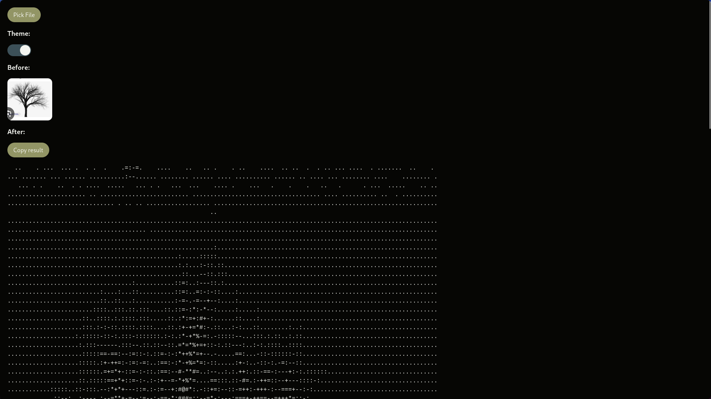

# Image to ASCII

This is a simple image to ASCII converter on ts.


# Table of Contents

- [Image to ASCII](#image-to-ascii)
- [Table of Contents](#table-of-contents)
- [Usage](#usage)
- [Installation](#installation)
- [Contrubuting](#contrubuting)
- [License](#license)

# Usage

The website contains: input button, theme toggle, image, pre, copy button
- input button
Press it and choose your image file(jpg, jpeg, png)
- Theme toggle
Use it to switch between light and dark mode
- Image
Display of your image
- Pre
Display of your image in ASCII
- Copy button
Press to copy output

# Installation

1. Clone repository 
```bash
git clone https://github.com/Vasya-556/Image-to-ASCII
```
2. Go into project folder
```bash
cd Image-to-ASCII
```
3. Install dependencies
```bash
npm install
```
4. Build
```bash
npx tsc
```
5. Open index.html with Live Server(or similiar)

# Contrubuting

Pull requests are welcome.

# License

[MIT](LICENSE)